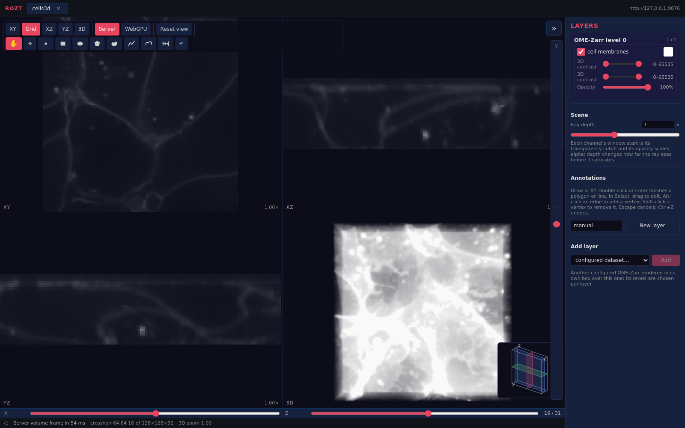

# ROZT

**Rusty OmeZarr Tiles** is a Rust viewer for OME-Zarr images, multidimensional
volumes, and their annotations.



ROZT provides progressive tiled 2D navigation, orthogonal slices, server and
WebGPU volume rendering, editable annotations, channel controls, and line
profiles. The browser interface talks to `newvolim-server`; the existing crate
names remain internal implementation identifiers.

## Build

Build the server and browser application:

```bash
cargo build --release -p newvolim-server
cd crates/newvolim-ui
trunk build --release
```

## Run

Datasets are registered by name and must be below an allowed root:

```bash
target/release/newvolim-server \
  --bind 127.0.0.1:9876 \
  --page-dir crates/newvolim-ui/dist \
  --allow-root /path/to/data \
  --dataset example=/path/to/data/example.ome.zarr
```

Open <http://127.0.0.1:9876/> and select the dataset.
